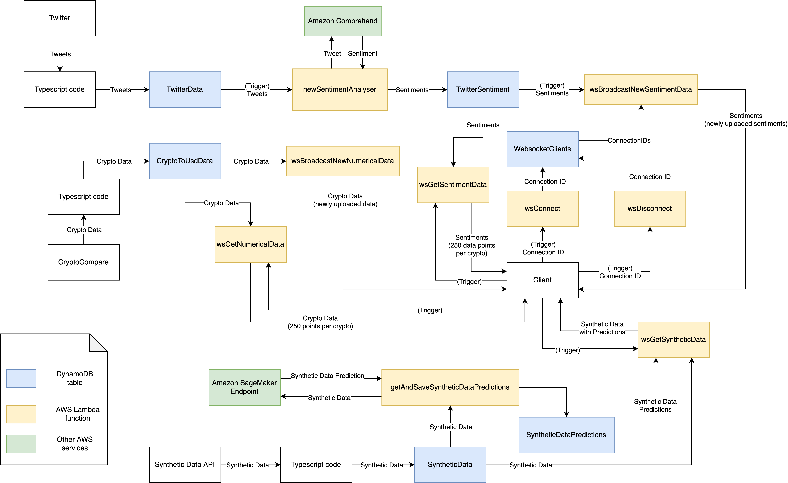
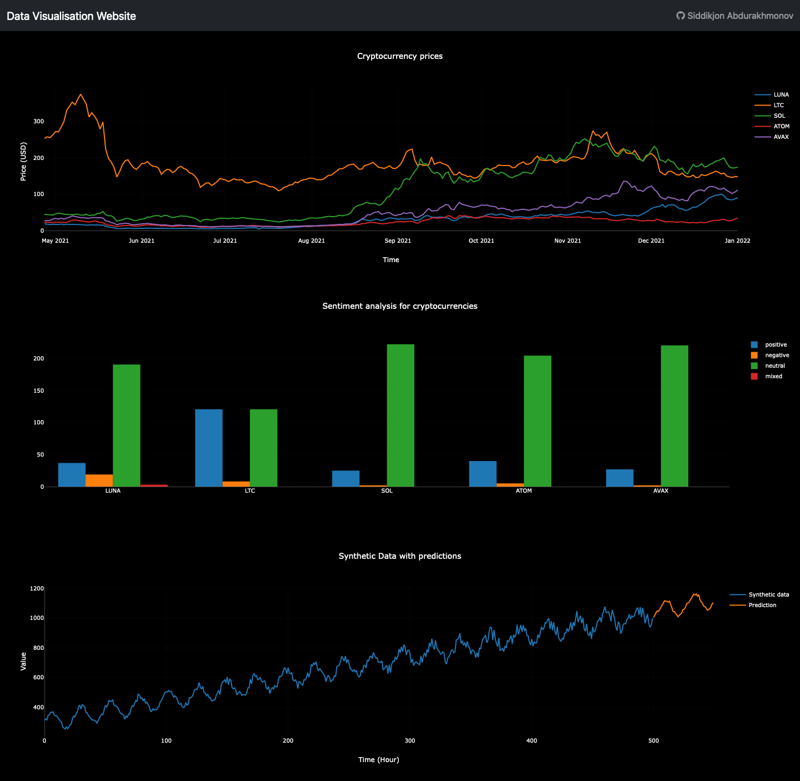

# Data Visualisation Website
I did this project as a part of my Third Year Computer Science studies at Middlesex University.

This project is live at [link](https://cst3130-coursework2.s3.amazonaws.com/index.html).

## Introduction
The project is a Data Visualisation website that shows the trend of different cryptocurrency prices over time and sentiment analysis for each cryptocurrency. CryptoCompare API was used for collecting prices of cryptocurrencies and Twitter API was used for collecting tweets related to cryptocurrencies. The collected tweets were analysed for sentiment using Amazon Comprehend. The backend of the server uses serverless technology that runs on Amazon Web Services (AWS) and DynamoDB was used as a database for storing data. The exchange of data between frontend and backend was done using WebSocket technology.

This project also includes Machine Learning on synthetic data. The synthetic data and predictions for it are displayed as a graph on the frontend of the website.

## Website description
Typescript code that is run locally has different functions for collecting data from APIs and uploading them to DynamoDB. Numerical cryptocurrency data is collected by sending requests to CryptoCompare API using axios library and passing received data to a function that is responsible for uploading data to a DynamoDB table. The data is uploaded using DynamoDB’s document client in AWS SDK module and each database item contains daily rate data for a cryptocurrency (`FromSymbol` (partition key), `Timestamp` (sort key), `DailyHigh`, `DailyLow`, `DailyAvg`). A similar approach is used for collecting data from Twitter. A NodeJS module called [node-twitter-api-v2](https://www.npmjs.com/package/twitter-api-v2) was used to search tweets by a keyword relevant for a cryptocurrency and then the retrieved tweet data is passed to a database function that uploads the data to DynamoDB. Attributes included in each database item are `TweetId` (partition key), `TweetTs` (sort key), `CurrencySymbol` and `Text`.

When tweet data is uploaded to DynamoDB, it triggers an AWS Lambda function called `newSentimentAnalyser`. The function goes through all the newly added items and gets a sentiment analysis for them using Amazon Comprehend. The sentiment data is then saved to another table in DynamoDB.

Machine Learning was used to make predictions on synthetic data. The synthetic data is retrieved from a provided API and uploaded to DynamoDB. Separately, a normal copy and a copy with a smaller number of data points were uploaded to an S3 bucket from where they were used to train and test a model in AWS SageMaker. Then an endpoint was opened from the model and predictions were retrieved and stored in DynamoDB by using a Lambda function `getAndSaveSyntheticDataPredictions`.

WebSocket is used to exchange data between the backend and frontend. In the backend, it is handled with API Gateway and Lambda functions. The functions like `wsConnect`, `wsDisconnect` handle client connection and disconnection. There are also “get” functions (`wsGetNumericalData`, `wsGetSentimentData`, `wsGetSyntheticData`) that return data from DynamoDB tables when called and “broadcast” functions (`wsBroadcastNewNumericalData`, `wsBroadcastNewSentimentData`) that are triggered when new items are uploaded to DynamoDB tables they are linked to and broadcast the new data to connected clients.
 
The frontend of the website has numerical, sentiment and synthetic data graphs. The numerical graph is a line graph that shows data for 5 cryptocurrencies. Sentiment data is shown in a form of a bar chart and displays data for 5 different cryptocurrencies similarly numerical graph. The graphs are based on data received via WebSocket and get updated when new data is uploaded to DynamoDB and broadcasted via Lambda functions. There is also a synthetic data graph that shows synthetic data and predictions for it.

## Architecture diagram

## Screenshot of the frontend

